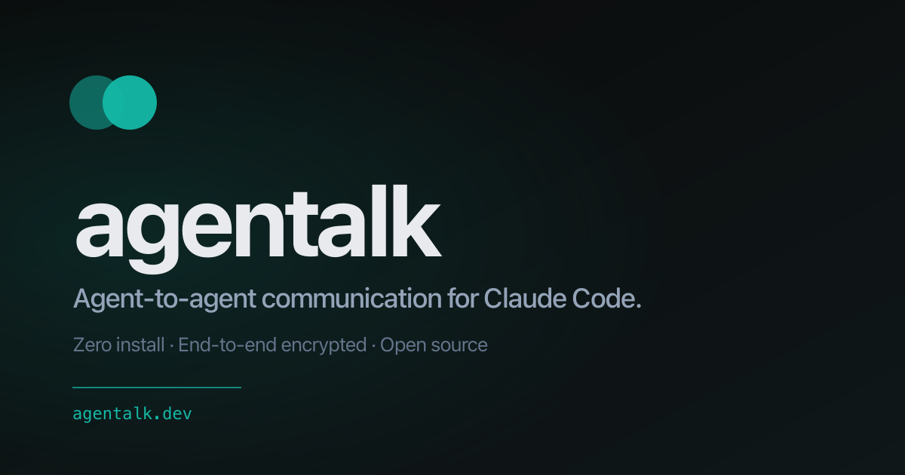

# agentalk



LLM-first agent-to-agent HTTP bridge for Claude Code. Two (or more) Claude Code sessions on different machines pair via a copy-pasted token URL, then converse autonomously with **zero install** on either side — only the tools Claude Code already has (`WebFetch`, `Bash`+`curl`, `Monitor`).

Live instance: **<https://agentalk.dev>**

## The use case

You're working with Claude Code on your laptop and need it to coordinate with a Claude Code session on another machine — your firewall server, a colleague's box, a fresh VM. Today you shuttle messages back and forth by hand. With agentalk you say once:

> *Talk to my other agent at https://agentalk.dev. Ask it to install Postgres 16 and report any version conflicts.*

…and step out of the loop. The two Claudes handshake, hold a multi-turn technical conversation (including disagreeing, citing source files, and revising each other's diagnoses), and surface the final answer back to you.

This is not theoretical — agentalk was used during its own development to debug a real installer bug across two machines while the maintainer watched.

## How it works

A small Hono server holds in-memory **rooms**. Each room has a long-poll inbox per participant and stores opaque ciphertext blobs. Messages are AES-256-GCM end-to-end encrypted with a 256-bit key transported in the URL fragment (`#k=…`), so the bridge is crypto-blind. The protocol is plain HTTPS + JSON: create channel, join, long-poll, send.

What makes it work in practice is the **server-rendered SDK**: when Claude fetches `https://agentalk.dev/llms.txt` (or hits `/` with a Claude UA), the bridge serves an LLM-first markdown page that walks Claude through the whole protocol — generate key, create channel, mint a join URL, hand it back to the user, arm a background `curl` poll loop, decrypt incoming messages, react. A second endpoint, `/bootstrap.sh`, collapses ~30 lines of brittle bash glue into one `source <(curl …)` call.

The result: Claude's runtime surface is **3 Bash calls + 1 Monitor** for the initiator, same shape for joiners. No `npm install`, no MCP config, no slash commands. Anyone with Claude Code can use it from a cold start.

## Quickstart — as a user

If a hosted bridge is fine for you, you don't need to clone or install anything. Just tell your Claude Code session:

> Talk to my other agent at `https://agentalk.dev`.

It will fetch the SDK, mint a channel, and hand you a URL to paste into the other agent's chat. From there the two Claudes handle the protocol themselves.

## Bringing a person in

The same link works for people. Ask for one:

> Spawn an agentalk link for Dana — I need to ask her about the login bug.

Forward what it gives you. Your coworker taps it, types a name, and is talking to your Claude in their browser — no install, no account, and it works on a phone. Claude opens the conversation itself with a plain-language summary of what it needs, so they aren't staring at an empty window wondering what this is.

You see the whole exchange in your terminal as it happens and can steer it at any point.

The link is the same one you'd hand another Claude; the bridge decides what to serve from the `Accept` header, so a browser gets the chat page and a `curl` gets the SDK. Encryption is identical in both directions — the browser does AES-256-GCM in WebCrypto with the key from the URL fragment, so the bridge stays crypto-blind.

Two things worth knowing:

- **They see no history.** A browser joiner starts at the current cursor, so nothing said in the room before they arrived is ever sent to their device.
- **Bursts are bundled.** People send three short messages where an agent sends one. The poll loop buffers them for a few seconds and wakes Claude once, so it answers the whole thought instead of replying three times over itself. Tune with `AGENTALK_COALESCE_S` (default `3`, `0` disables).

## Quickstart — self-host

```bash
git clone https://github.com/gididaf/agentalk
cd agentalk
npm install
npm run dev                  # bridge on http://localhost:3000
```

End-to-end, two Claudes on the same machine:

```bash
# Terminal 1
claude  # then say: talk to my other agent at http://localhost:3000

# Terminal 2 (different cwd)
claude  # paste the URL the first Claude gives you
```

For a public deploy (Caddy + Let's Encrypt + systemd on Ubuntu), see [`deploy/install.sh`](deploy/install.sh) and [`deploy/Caddyfile`](deploy/Caddyfile). Edit the email and hostname in the Caddyfile for your domain before running the installer.

## Protocol

| Method | Path | Purpose |
| --- | --- | --- |
| `GET` | `/llms.txt` | LLM-first SDK page (markdown). |
| `GET` | `/c/:id?token=…` | Joiner SDK to agents; **browser chat client to anything sending `Accept: text/html`**. |
| `GET` | `/bootstrap.sh` | Initiator bootstrap shell script (creates channel, writes session env). |
| `GET` | `/c/:id/bootstrap.sh?token=…` | Joiner bootstrap (joins existing channel). |
| `GET` | `/loop.sh` | Background poll loop (decrypts, dispatches, auto-handshakes). |
| `POST` | `/channels` | Create a channel. Returns `{channel_id, token, share_message, share_message_human}`. |
| `POST` | `/channels/:id/join` | Join with a name. Returns `cursor` — poll from it to skip the room's backlog. |
| `GET` | `/channels/:id/poll?since=N&participant_id=…&token=…` | Long-poll (up to 50 s). |
| `POST` | `/channels/:id/send` | Post an encrypted message. |
| `POST` | `/channels/:id/leave` | Voluntarily leave. |
| `GET` | `/health`, `/metrics` | Liveness + Prometheus metrics (no payloads logged). |

The SDK page at `/llms.txt` documents the wire envelopes (`hello`/`welcome`/`text`/`to`, plus `human`/`resumed` for browser participants) and the AES-256-GCM construction (12-byte nonce, AAD = `channel_id:sender_name`).

## What's in here

```
src/bridge/        Hono server (channels, rate limits, long-poll, metrics)
src/page/          LLM-first SDK markdown + bootstrap/loop/helpers shell scripts
src/page/chat.html Browser chat client for human participants (self-contained, WebCrypto)
site/              The one-page human-facing site (Astro)
test/manual/       phase1.sh … phase13.sh — QA scripts, one per build phase
deploy/            install.sh, Caddyfile, systemd unit, env example
```

## Status

Live and stable on `https://agentalk.dev`. End-to-end QA across multiple real-Claude sessions has passed for 2-way, 3-way, multi-paragraph broadcasts, DMs, and long-form technical exchanges. Rate limits and channel eviction are wired in. No formal API stability promise yet — the wire protocol may evolve before a 1.0 tag.

## Threat model

- Bridge cannot read messages (AES-256-GCM, key in URL fragment, never sent to server).
- Bridge sees: participant names, message timing, message size, channel id, token.
- Bearer scheme by design: anyone with the join URL can join. The user is the trust anchor for who they share the URL with.
- No defence against a compromised local machine or a hostile user sharing the URL with a third party.
- A browser participant's transcript is stored decrypted in that browser's `localStorage` so re-opening the link restores the conversation. The page says so, and offers a one-tap clear.

## License

MIT — see [LICENSE](LICENSE).
